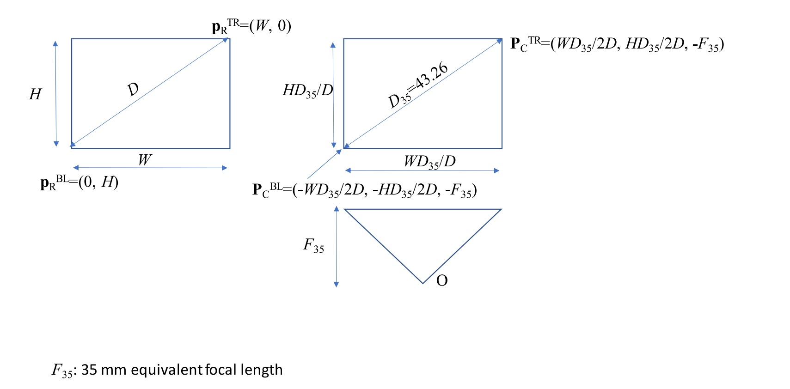

# Camera matrix
## Variable naming convention
Bold : vector  
Italic : scalar  
Non-bold, Non-italic : matrix  
Upper case : in homogeneous coordinate  
Lower case : in real coordinate  
subscript  
character | description
--|--
C | in camera coordinate
P | in unit projection coordinate
R | in viewport coordinate
W | in world coordinate
 

superscript  
character | description
--|--
D | delta, step, small change
E | end, edge
C | center
O | origin
 

__P__ = [ _X_ , _Y_ , _Z_ ]T : point in 2D homogeneous coordinate  
__P__ = [ _X_ , _Y_ , _Z_ , _W_ ]T : point in 3D homogeneous coordinate  
__p__ = [ _x_, _y_ ]T : point in 2D real coordinate  
__p__ = [ _x_, _y_ , _z_ ]T : point in 3D real coordinate

## Projection matrix from camera coordinate to viewport coordinate
__P__C , homogeneous camera coordinate is transformed to __P__R by  
__P__R = MI M0  __P__C ----- (1)  
, where MI is a camera intrinsic matrix and M0 is the dimension reduction matrix,  
MI = [  
&nbsp; &nbsp; _m_I00 , _m_I01 , _m_I02 ;  
&nbsp; &nbsp; _m_I10 , _m_I11 , _m_I12 ;  
&nbsp; &nbsp; _m_I20 , _m_I21 , 1 ;  
] ,  
M0 = [  
&nbsp; &nbsp; 1 , 0 , 0 , 0 ;  
&nbsp; &nbsp; 0 , 1 , 0 , 0 ;  
&nbsp; &nbsp; 0 , 0 , 1 , 0 ;  
] .  
MI is defined as an upper triangle matrix in many textbooks but I think that
MI is a homography matrix mapping a genera four corners in 3D space to another four corners
which can be projected to a rectangle in a rendering plane.  
The real coordinate of __P__R is  
__p__R = [ _x_R , _y_R ]T = 
[ _X_R / _Z_R , _Y_R / _Z_R]T  
 
<!--
  relationship among viewport parameters and the canonical projection plane coords
-->
In many non-metrological cases, MI can be approximated as an upper triangle matrix as  
MI = [  
&nbsp; &nbsp; _&alpha;_0 , 0 , _&beta;_0 ;  
&nbsp; &nbsp; 0 , _&alpha;_1 , _&beta;_1 ;  
&nbsp; &nbsp; 0 , 0 , 1 ;  
]  
with four unknown parameters, _&alpha;_0, _&alpha;_1 , &beta;0 , &beta;1 .
Derivation process of the parameters are described below.  
  
Figure 1. Camera parameter description   
M = MI M0 = [  
&nbsp; &nbsp; _&alpha;_0 , 0 , _&beta;_0 , 0 ;  
&nbsp; &nbsp; 0 , _&alpha;_1 , _&beta;_1 , 0 ;  
&nbsp; &nbsp; 0 , 0 , 1 , 0 ;  
]  
__P__RTR = M __P__CTR ,  
__P__RBL = M __P__CBL ,  
where superscript `TR`, `BL` mean top-right and bottom-left.  
__P__RTR = [  
&nbsp; &nbsp; _&alpha;_0 , 0 , _&beta;_0 , 0 ;  
&nbsp; &nbsp; 0 , _&alpha;_1 , _&beta;_1 , 0 ;  
&nbsp; &nbsp; 0 , 0 , 1 , 0 ;  
] [ _X_CTR , _Y_CTR , _Z_CTR ]T  
= [ _&alpha; X_CTR + _&beta;_0 _Z_CTR ,
_&alpha; Y_CTR + _&beta;_1 _Z_CTR ,
_Z_CTR ]  
Converting a projection coordinate __P__RTR to __p__RTR ,  
__p__RTR = [ _W_, 0 ] =  
[
  (_&alpha;0 X_CTR + _&beta;_0 _Z_CTR) /
  _Z_CTR ,
  (_&alpha;1 Y_CTR + _&beta;_1 _Z_CTR) /
  _Z_CTR
]  
Similarily,  
__p__RBL = [ 0, _H_ ] =  
[
  (_&alpha;0 X_CBL + _&beta;_0 _Z_CBL) /
  _Z_CBL ,
  (_&alpha;1 Y_CBL + _&beta;_1 _Z_CBL) /
  _Z_CBL
]  
Writing in a matrix equation,  
[ _W_ , 0 , 0 , _H_ ]T = [  
&nbsp; &nbsp; _X_CTR / _Z_CTR , 0 , 1 , 0 ;  
&nbsp; &nbsp; 0 , _Y_CTR / _Z_CTR , 0 , 1 ;  
&nbsp; &nbsp; _X_CBL / _Z_CBL , 0 , 1 , 0 ;  
&nbsp; &nbsp; 0 , _Y_CBL / _Z_CBL , 0 , 1 ;  
] [ _&alpha;_0 , _&alpha;_1 , _&beta;_0 , _&beta;_1 ]T ,  
where  
_X_CTR = _W D_35 / (2 _D_) ,  
_Y_CTR = _H D_35 / (2 _D_) ,  
_X_CBL = -_W D_35 / (2 _D_) ,  
_Y_CBL = -_H D_35 / (2 _D_) ,  
_Z_CTR = _Z_CBL = -_F_35 .  
That is the derivation of camera intrinsic matrix approximated with 35 mm equivalent focal length.  

## Camera Extrinsic Matrix
It is also called Camera Position Matrix. It is an inverse of a transform matrix moving a camera from the origin
to an actual camera origin. Decomposing the transform matrix, camera position movement is intuitively understandable.  
In the original position, the camera optical axis is aligned to Z axis negative direction. The camera upward direction
is aligned to Y-axis positive direction. The camera origin is at the world origin.  
Decomposed movements are  
1. rotation about optical axis,
2. rotation about X-axis (elevation angle),
3. rotation about Y-axis (azimuth angle),
4. linear movement.

## Camera Viewline
It is needed to calculate viewlines in world coordinates from viewport pixel coordinate.
The process is described below.
A projection matrix M is defined as  
M = [  
&nbsp; &nbsp; _m_00 ,  _m_01 ,  _m_02 ,  _m_03 ;  
&nbsp; &nbsp; _m_10 ,  _m_11 ,  _m_12 ,  _m_13 ;  
&nbsp; &nbsp; _m_20 ,  _m_21 ,  _m_22 ,  _m_23 ;  
]  

__P__R = M __P__W  
[ _X_R , _Y_R , _Z_R ]T = [  
&nbsp; &nbsp; _m_00 ,  _m_01 ,  _m_02 ,  _m_03 ;  
&nbsp; &nbsp; _m_10 ,  _m_11 ,  _m_12 ,  _m_13 ;  
&nbsp; &nbsp; _m_20 ,  _m_21 ,  _m_22 ,  _m_23 ;  
] [ _x_W , _y_W , _z_W , 1 ]T  
_X_R = _m_00 _x_W + _m_01 _y_W +
_m_02 _z_W + _m_03 ,  
_Y_R = _m_10 _x_W + _m_11 _y_W +
_m_12 _z_W + _m_03 ,  
_Z_R = _m_20 _x_W + _m_21 _y_W +
_m_22 _z_W + _m_23 ,  
Converting 2D projection coordinate __P__R to real coordinate __p__R,  
_x_R = _X_R / _Z_R =
(_m_00 _x_W + _m_01 _y_W + _m_02 _z_W + _m_03) /
(_m_20 _x_W + _m_21 _y_W + _m_22 _z_W + _m_23) ,  
_y_R = _Y_R / _Z_R =
(_m_10 _x_W + _m_11 _y_W + _m_12 _z_W + _m_13) /
(_m_20 _x_W + _m_21 _y_W + _m_22 _z_W + _m_23) ,  
Linearizing these equations, two equations defining two planes are obtained as follows,  
_x_R (_m_20 _x_W + _m_21 _y_W + _m_22 _z_W + _m_23) =
_m_00 _x_W + _m_01 _y_W + _m_02 _z_W + _m_03 ,  
_y_R (_m_20 _x_W + _m_21 _y_W + _m_22 _z_W + _m_23) =
_m_10 _x_W + _m_11 _y_W + _m_12 _z_W + _m_13 ,  
_x_W ( _x_R _m_20 - _m_00 ) +
_y_W ( _x_R _m_21 - _m_01 ) +
_z_W ( _x_R _m_22 - _m_02 ) +
_x_R _m_23 - _m_03 = 0 ----- plane0 ,  
_x_W ( _y_R _m_20 - _m_10 ) +
_y_W ( _y_R _m_21 - _m_11 ) +
_z_W ( _y_R _m_22 - _m_12 ) +
_y_R _m_23 - _m_13 = 0 ----- plane1 ,  
The intersection of plane0 and plane1 is the viewline of the camera.
The camera origin must be on the viewline. Therefore the reference point of the viewline is
the camera origin. The direction vector shall be the crossproduct of the normal vectors of the planes or
its negated. The dot product of the direction vector and a vector from the camera origin to the look-at
point shall be positive. Using the condition, a valid direction vector is selected.  
__V__N0 = [ _x_R _m_20 - _m_00 ,
_x_R _m_21 - _m_01 , _x_R _m_22 - _m_02 ] ,  
__V__N1 = [ _y_R _m_20 - _m_10 ,
_y_R _m_21 - _m_11 ,
_y_R _m_22 - _m_12 ] ,  
The direction vector candidate is  
__V__DIRCAN = __V__N0 &Cross; __V__N1 .  
if &lt;__V__DIRCAN , (__P__LOOKAT - __O__C)&gt; &lt; 0 ,  
__V__DIR = -__V__DIRCAN  
else  
__V__DIR = __V__DIRCAN .  
